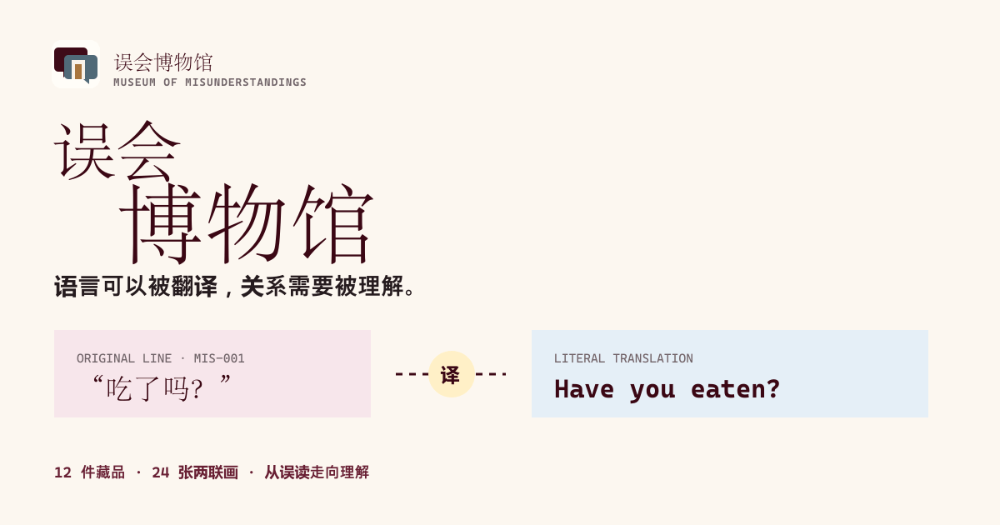

<p align="center">
  
</p>

# 误会博物馆

> 语言可以被翻译，关系需要被理解。

误会博物馆是一座收藏跨文化话语与关系语境的线上博物馆。每件藏品从一句原话出发，依次看见字面、误读、语境与重新靠近彼此的下一句话。

## 访问

- 推荐入口（已完成当前中国大陆网络环境访问验证）：<https://joyceleo326.github.io/misunderstanding-museum/>
- 备用入口：<https://misunderstanding-museum.vercel.app/>
- GitHub：<https://github.com/JoyceLeo326/misunderstanding-museum>
- 四页策展档案：[`assets/misunderstanding-museum-case-study.pdf`](assets/misunderstanding-museum-case-study.pdf)

两个入口发布同一份验证后的静态内容；不同地区、运营商与时段的网络策略可能变化。

## 怎样完成一次参观

### 从馆藏理解语境

1. 在门廊选择你与对方的关系、当前观察视角，以及这次对话真正想达成的目标。
2. 查看系统为本次情境排出的三件优先馆藏；推荐会随关系、视角和目标变化，不是固定热门榜。
3. 打开馆藏，先看原话与字面理解，再切换“补上语境”，阅读误读如何发生和下一句话如何修复关系。
4. 用“原话 → 字面 → 语境 → 下一句”四层结构完成观察，并把有帮助的藏品标记为已阅。
5. 在藏品卡制作器中写下准备带回真实对话的一句话，预览后复制或下载 Markdown 卡片。

### 从具体事件形成沟通档案

1. 进入和解工作台，写下发生的具体时刻、双方说了什么，以及你希望关系走向哪里。
2. 依次检查表达者、接收者和共同关系三种视角，补充容易被忽略的语境。
3. 比较三条候选路径。每条路径都会说明适用条件、收益、代价、下一句话和对应馆藏依据。
4. 选择路径并明确接受取舍；只有再次人工确认后，V1 沟通档案才可下载。
5. 真实对话发生后，回填“更理解、仍没说清、需要空间、需要更具体”等结果与说明。
6. 系统保留 V1 并展示下一版提案的实际变化；重新确认后形成 V2，Markdown 档案同时记录选择、反馈、差异和版本历史。

### 第一次体验建议

先使用馆内默认案例完整走一遍“字面 → 语境 → 下一句”，再进入和解工作台替换成自己的事件。不要从推荐分数直接跳到下载：先读完三条路径的代价，再选择真正愿意承担的沟通方式。

## 馆内内容

- 4 个固定展厅：关系、异乡生活、同好暗号、网络语境；
- 12 件可筛选馆藏，每件都有字面、语境与共同注释问题；
- 12 组“误读发生 / 补上语境”两联画，共 24 张自托管故事插画；图像在首屏展签、首件藏品、馆藏卡与详情切换中承担叙事，而非作为装饰图库；
- 可改写的参观线索：关系、观察视角与对话目标会共同改变三件优先馆藏、观察问题与建议的下一句话；
- 可回填真实对话结果：更理解、仍没说清、需要空间或需要更具体会生成下一版本提案；界面逐项呈现实际发生的路线、下一句、复盘或候选图差异，没有变化的项目不会被宣称已改变；
- 和解工作台：具体事件依次经过表达者、接收者与共同关系三种视角，形成三条带适用条件和代价的候选路径；关系、目标、所在视角与真实反馈会改变排序和对应故事图；
- 人工确认与沟通档案：只有使用者明确确认一条路径后，才可下载包含事件底稿、多视角、取舍、下一句、已阅馆藏与下一轮复盘的 Markdown 档案；
- 一条完整的关系叙事：从具体时刻与误读冲突出发，经过用户选择，生成期待结果与回访复盘；
- 本次参观进度、已阅标记、动态回执与三轴五级“编辑定性坐标”；
- “只看字面 / 补上语境”双态互动展签；
- 四层语境观察：原话、字面、语境、下一句；
- 藏品卡制作器：实时预览、复制、Markdown 下载与草稿恢复；
- 参观记录：可保存准备带回真实对话的一句话，并下载包含路线、人的确认、结果与复盘提示的沟通档案；
- 每件内容都标注“编辑复合故事”或“编辑情境示例”，避免把示例误读为真实投稿；
- 策展室：内容结构、共同策展、观察与复盘；
- 馆藏公约：授权、匿名、去刻板印象与撤回机制。

## 移动端与可访问性

- mobile-first 响应式布局，覆盖 320px 至桌面宽度；
- iPhone 安全区、`100svh / 100dvh`、16px 表单输入与至少 44px 触控区；
- 移动端四项底部导览，桌面端使用紧凑顶部导航；
- 移动端馆藏详情使用可关闭底部展签，并提供上一件 / 下一件连续浏览；
- 渐进增强：脚本或 IntersectionObserver 失败时，正文仍默认可见；
- 键盘焦点、语义化地标、标签、状态播报与 reduced-motion 支持；
- 进入、切换、制卡与已选藏品均有克制微动效，并自动尊重 reduced-motion；
- Service Worker 缓存已访问页面与核心资源，改善回访和弱网体验。

## 本地运行

无需构建工具：

```bash
python3 -m http.server 8000
```

打开 <http://localhost:8000>。

质量检查与静态产物：

```bash
npm test
npm run check
npm run build
npm run security:secrets
npm run security:secrets -- --dir dist
```

`npm run build` 生成 `dist/` 静态发布目录。测试使用 Node.js 内置 Test Runner，不需要浏览器账号或后端服务。

## 部署

- `.github/workflows/ci.yml` 运行测试、语法检查、源码/构建产物凭据扫描，并发布 GitHub Pages；
- `vercel.json` 将 `dist/` 作为同一静态产品的备用部署；
- 部署产物不包含环境文件、服务端路由、数据库配置、分析 SDK 或用户参观记录；
- 线上运行资源均为仓库内相对路径，不依赖外部字体或 CDN。

## 文件结构

```text
.
├── index.html
├── styles.css
├── mission.js
├── visual-core.js
├── script.js
├── manifest.webmanifest
├── sw.js
├── scripts/
├── tests/
├── vercel.json
├── assets/
├── docs/
└── research/
```

## 技术边界

- Semantic HTML、原生 CSS 与 Vanilla JavaScript；
- 不依赖外部字体、前端框架、分析脚本、Cookie、数据库或后端；
- 参观线索、反思记录与藏品卡草稿仅保存在当前设备；
- Vercel 可直接托管，GitHub Actions 会在测试、语法检查、源码与构建产物密钥扫描全部通过后发布 Pages。

## 数据与隐私

- 参观进度、已阅标记、参观线索、事件草稿、反馈和藏品卡草稿保存在当前浏览器；静态站点没有账户数据库或跨设备同步。
- 清理站点数据、使用受限隐私模式或更换浏览器配置文件可能删除本地记录；需要长期保留时，请下载 Markdown 沟通档案。
- 页面不会上传用户填写的事件或对话，不加载分析脚本，也不会向 AI 服务发送内容。
- 请不要在公开 Issue、PR、截图或示例馆藏中提交真实姓名、联系方式、未授权对话或其他可识别信息。
- 贡献馆藏时应取得授权、完成匿名化，并遵守馆藏公约中的撤回与去刻板印象要求。

## 已知边界

- 馆藏为编辑复合故事或编辑情境示例，不代表某个真实投稿者，也不应被当作对某一文化或群体的概括。
- 推荐路线用于帮助看见语境与取舍，不是心理咨询、冲突仲裁、法律建议或安全风险评估。
- 涉及暴力、胁迫、跟踪、歧视、严重权力不对等或人身安全时，不应只依赖本工具处理。
- 本地 Markdown 档案记录的是使用者当时的选择与复盘，不证明另一方同意该解释。
- Service Worker 改善回访体验，但首次访问和未缓存资源仍需要网络；第三方托管可达性可能随地区和运营商变化。

## 策展文档

- [`docs/01-brand-strategy.md`](docs/01-brand-strategy.md)
- [`docs/02-content-system.md`](docs/02-content-system.md)
- [`docs/03-hero-note.md`](docs/03-hero-note.md)
- [`docs/04-ugc-koc-playbook.md`](docs/04-ugc-koc-playbook.md)
- [`docs/05-measurement-plan.md`](docs/05-measurement-plan.md)
- [`docs/06-content-safety.md`](docs/06-content-safety.md)
- [`docs/07-visual-identity.md`](docs/07-visual-identity.md)
- [`docs/08-story-asset-manifest.md`](docs/08-story-asset-manifest.md)

## 版本

- `v5.1 · 2026-08`：新增 V1 → 反馈提案 → 人工重新确认 → V2 的决策历史；反馈只呈现真实差异，反馈后原确认立即失效，下载档案同时保留前后版本、取舍和重新确认记录。
- `v5.0 · 2026-08`：把事件录入、多视角解析、三条方案对照、人工确认、沟通档案下载与真实反馈回流连成一个连续工作台；候选顺序与故事证据图由关系、目标、所在视角和反馈共同驱动，并补齐严格的 44px 触控与小屏输入安全区。
- `v4.0 · 2026-08`：完成双展签门廊品牌系统与 24 张两联画故事插画；把图像接入首屏、首展、馆藏与移动端详情；新增真实对话反馈驱动的下一轮路线、下一句与复盘；完成 320 / 390 / 430px 全流程浏览器验收。
- `v3.0 · 2026-08`：加入由关系、视角与目标共同驱动的个性参观路线，补齐具体人物与时刻、冲突、选择、结果、复盘及本地 Markdown 导出；新增静态构建、测试与双重密钥扫描发布门禁。
- `v2.3 · 2026-07`：恢复首屏逐字与章节逐行浮现，重排中文主标题，将第三展区改为更友好的“语境观察室”，并加入克制的馆藏 emoji 线索。
- `v2.2 · 2026-07`：补齐内容来源标识，将连续百分比改为有口径的五级编辑判读；移动端馆藏详情升级为底部展签，并加入上下件浏览、关闭与键盘退出。
- `v2.1 · 2026-07`：新增真实会话态参观进度、动态回执、馆藏已阅标记与编辑语境坐标，补强移动端信息层次与微动效。
- `v2.0 · 2026-07`：重构参观叙事与视觉系统，补齐 12 件可交互馆藏、移动端导览、本地藏品卡生成、渐进增强和弱网回访缓存。
- `v1.1 · 2026-07`：完善四个展厅、UGC 策展、创作者协作与观察框架。
